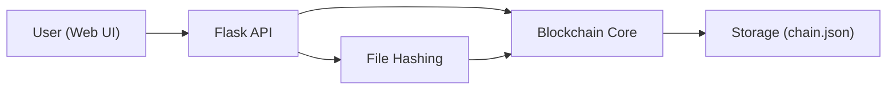

# TrustNet — Decentralized Document Tracker

TrustNet is a lightweight blockchain-based system for recording and verifying document authenticity. Upload a file to record its hash on-chain, then verify any file later to confirm whether it matches the original.

## Features
- Record file hashes on a simple blockchain ledger
- Verify authenticity via hash comparison
- Auto-mining and manual mining endpoints
- Consensus (longest valid chain)
- Web UI for upload, verification, and chain viewing


## Architecture


## Quick Start

1. Create and activate a virtual environment (recommended).
   ```bash
   python3 -m venv .venv
   source .venv/bin/activate
   ```
2. Install dependencies:
   ```bash
   pip install -r requirements.txt
   ```
3. Run the app:
   ```bash
   python main.py
   ```
4. Open the UI:
   ```
   http://localhost:5000
   ```

## API Endpoints (Summary)
- `GET /status` — app and chain status
- `GET /chain` — full chain payload
- `POST /file/upload` — upload and record a file hash
- `POST /file/verify` — verify a file against the chain
- `GET /mine` — mine a single block
- `POST /mine/auto` — start/stop auto-mining
- `POST /nodes/register` — register peer nodes
- `GET /nodes/resolve` — resolve conflicts by longest valid chain

## Notes
- Stored data lives in `data/chain.json` by default.
- Uploads are saved in `uploads/`.
- The chain file is validated on startup; if invalid, a new genesis chain is used.

## Tests
To run tests (requires `pytest`):
```bash
pip install -r requirements-dev.txt
pytest
```

## Project Structure
- `app/` — core blockchain, routes, mining, and storage
- `static/` — frontend UI
- `data/` — persisted chain
- `uploads/` — stored uploads

## License
MIT
